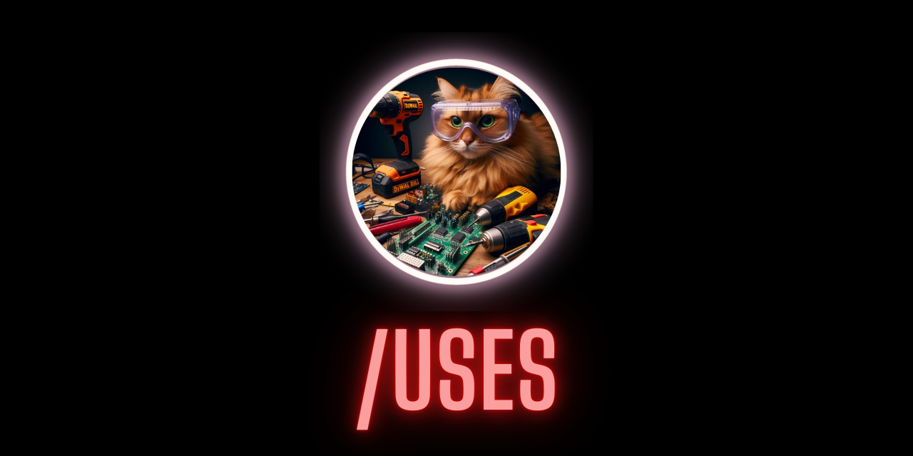

  

> What my gear is, what OS I am using, what editor, etc...

## Table of Contents
- [Table of Contents](#table-of-contents)
- [The Hardware](#the-hardware)
- [Software](#software)
- [Home Server](#home-server)
  - [Server software](#server-software)
- [I Use a lot of software, I admit](#i-use-a-lot-of-software-i-admit)

## The Hardware

Let’s start with my gear which you can find on [KIT](https://kit.co/tiffanywhite/my-office).

## Software

- [VS Code](https://code.visualstudio.com/)
  - I also use [Frontmatter](https://frontmatter.codes) as a markdown CMS right in VS Code.
- [iTerm2](https://iterm2.com/)
- [Warp terminal](https://www.warp.dev/)
- Arc Browser for admin, home lab, testing, and research.
- Safari for docs and research
- Microsoft Edge for search with Bing Chat
- Jetbrains IDEs
  - PyCharm CE
  - RustRover Pre-release
  - CLion
  - GoLand
- [Raycast](https://raycast.com/) instead of Alfred
- Text Expander
- [Things](https://culturedcode.com/things/) for tasks.
- [Obsidian](https://obsidian.md) for loosely coupled notes.
- [ScreenFlow](https://www.telestream.net/screenflow/overview.htm)
  - I use this to record videos for the whole hashtag build in public thing on LinkedIn.
- [StreamLabs OBS Software for Mac](https://streamlabs.com/)
  - Best OBS client on the Mac.
- [CleanShot X](https://cleanshot.com/) for the best screenshots you're going to get on any platform.

[☝️Top](#table-of-contents)

## Home Server
Yeah I am running a home server of sorts, as my fascination with Home Assistant, InfoSec, and networking/network security continues to grow.

Below is a list of the hardware I use for the rack. Click the details button to see the softare I am running on the network for server and IoT purposes.

You can find my whole HomeLab Setup
 [here on GitHub](https://homelab.tifflabs.org).

[☝️Top](#table-of-contents)

### Server software
Some of the software running on the servers

<table>    
  <thead>
    <tr>      
      <th>Infrastructure</th>
      <th>OS</th>
    </tr>
  </thead>      
  <tbody>
    <tr>
      <td width="50%">
        
        
        
        
        
        
      </td>
      <td valign="top" width="50%">
        
        
        
        
      </td>
    </tr>
  </tbody>    
</table>

<table>
  <thead>
    <tr>
      <th>Tools & Runners</th>
      <th>Software</th>
      <tbody>
        <td valign="top" width="50%">
        
        
        
        
        
      </td>
      <td valign="top" width="50%">
        
        
        
         
          
          
          
      </td>
      </tbody>
    </tr>
  </thead>
</table>

## I Use a lot of software, I admit

But I use ALL OF IT.

So this is my setup and what I am currently using. You can show me your dev setup on [Mastodon](https://fosstodon.org/@tiff).

[☝️Top](#table-of-contents)
